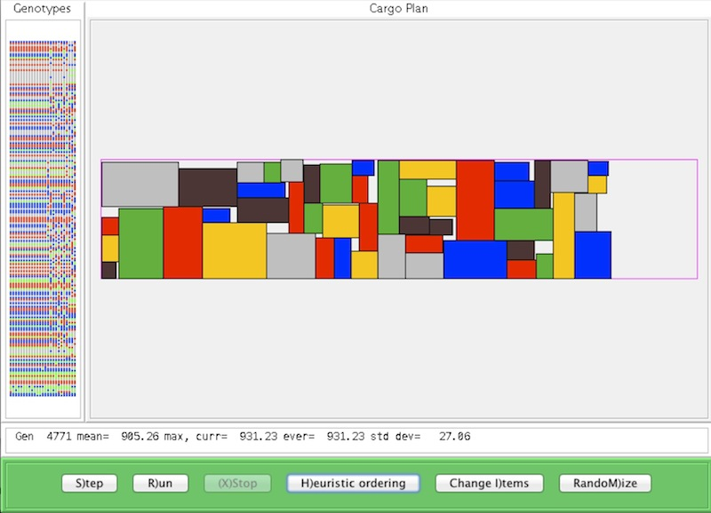

Checkers
===========

Cargo uses a genetic algorithm to attempt to pack a set of rectangular boxes
into a rectangular cargo hold as efficiently as possible.
It is implemented here as an Eclipse Java project.

The most efficient packing is defined to be the one that extends the minimum distance towards the
right side of the cargo hold.

Each possible configuration of the boxes is called a 'member' of the population, and
is represented as a distinct ordering of boxes.  As each box in this ordering is processed, the first
location where it fits is found by scanning from top to bottom, starting at the left edge of the
cargo hold and moving right only as far as necessary.

Starting with a population of random members (i.e., random permutations of box indices),
the population is modified by using the standard techniques of genetic algorithms (mutation and crossover) to find a good solution.

Loading the page "Applet.html" within a browser should (maybe) start the program.
Failing that, from a command line you can try "appletviewer Applet.html".

